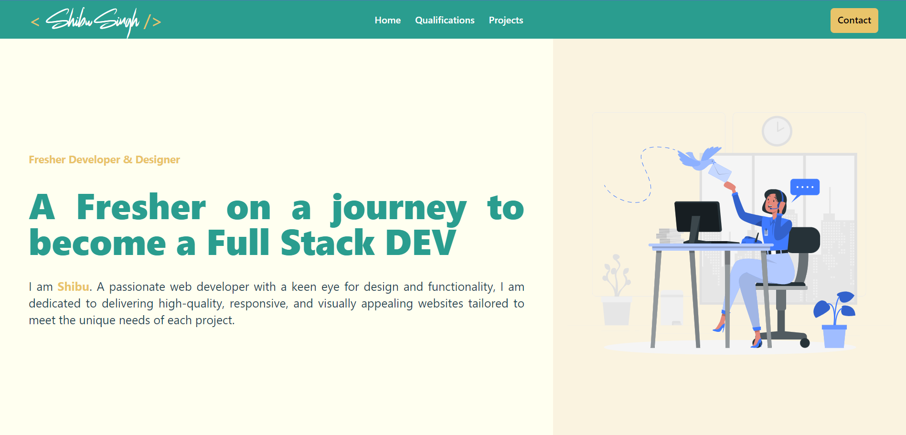

# 🚀 Shibu Singh's Portfolio

Welcome to my personal portfolio website! This project showcases my skills, experience, and projects in a visually appealing and responsive design.



## 📋 Table of Contents

- [About](#about)
- [Features](#features)
- [Technologies](#technologies)
- [Installation](#installation)
- [Usage](#usage)
- [Contact](#contact)
- [License](#license)

## 🌟 About

This portfolio website is designed to present my professional background, including my skills, education, projects, and contact information. It is built with modern web development technologies to ensure a seamless and responsive user experience.

## ✨ Features

- Responsive Design
- Smooth Scrolling and Transitions
- Dynamic Skill Badges
- Projects Showcase
- Contact Form with Validation
- Navigation Bar with Burger Menu for Mobile

## 🛠️ Technologies

- **Frontend:**
  - React.js
  - Tailwind CSS
  - HTML5
  - CSS3
- **Deployment:**
  - Vercel / Netlify

## 🖥️ Installation

To run this project locally, follow these steps:

1. Clone the repository:

   ```sh
   git clone https://github.com/ShibuSingh2k01/Portfolio.git
   cd Portfolio
   ```

2. Install dependencies:

   ```sh
   npm install
   ```

3. Start the development server:
   ```sh
   npm run dev
   ```

## 🚀 Usage

Once the development server is running, you can view the portfolio in your browser at your localhost. Explore different sections like Home, Qualifications, Projects, and Contact to see the complete functionality.

## 📝 Customization

Feel free to customize the content and design of this portfolio to better suit your personal style and needs. Here are some areas you might consider updating:

- Personal Information: Update your name, about section, and contact details.
- Projects: Add your projects along with descriptions and links.
- Skills: Modify the skill badges and their order to reflect your expertise.

## 📬 Contact

If you would like to get in touch, you can reach me via:

- Email: [work.shibusingh@gmail.com](https://mail.google.com/mail/u/0/?fs=1&tf=cm&to=work.shibusingh@gmail.com)
- LinkedIn: [linkedin.com/in/shibusingh6122001](https://www.linkedin.com/in/shibusingh6122001/)
- GitHub: [github.com/ShibuSingh2k01](https://github.com/ShibuSingh2k01)

## 📄 License

This project is licensed under the MIT License. See the [LICENSE](LICENSE) file for more details.

## 🌐 Hosted Live

Check out my Portfolio Live [here](https://shibu-singh.netlify.app/)

## 🌟 Acknowledgements

- Icons by FontAwesome
- Illustrations by Undraw
